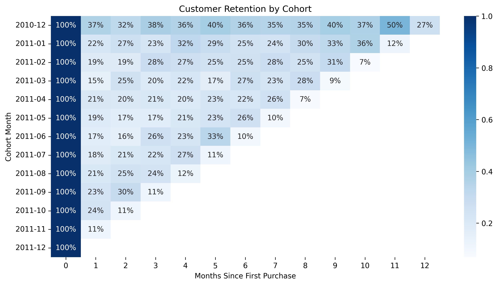

# [E-Commerce Analytics:] - [Customer Behavior, RFM Segmentation and Market Basket Recommendations]


  
<!-- Replace with a real screenshot of your dashboard/heatmap/key visual -->

## 📊 Project Overview

A comprehensive end-to-end data analytics project on the Online Retail dataset.  
Goals:  
- Understand customer purchasing patterns  
- Segment customers using RFM analysis  
- Discover product associations with market basket analysis (Apriori)  
- Build simple rule-based product recommendations  
- Provide actionable business insights for cross-selling, personalization & inventory

**Key results** (customize with your numbers):  
- Analyzed 500k+ transactions from 4,300+ customers  
- Identified 50+ strong association rules (lift > 2)  
- Top products: WHITE HANGING HEART T-LIGHT HOLDER, etc.  
- Average order value: £XX.XX | High-value customers drive XX% of revenue

## 🎯 Business Impact & Recommendations

- **Cross-selling**: Bundle high-lift pairs (e.g. T-light holders + lanterns)  
- **Personalization**: Recommend based on past purchases for returning customers  
- **Inventory**: Prioritize frequently co-purchased items to reduce stockouts  
- **Marketing**: Target top 20% customers (high RFM) with loyalty offers  

## 🛠️ Tech Stack

- **Language**: Python 3.10+  
- **Core libraries**: pandas, numpy, matplotlib, seaborn  
- **Association rules**: mlxtend (Apriori + association_rules)  
- **Environment**: Jupyter Notebook / Anaconda  
- **Other**: os, datetime

## 📁 Project Structure
ecommerce-analytics/
├── data/                    # Raw & cleaned data (gitignore large files)
│   └── online-retail-cleaned.csv
├── notebooks/               # All analysis notebooks
│   ├── 01_Data_Cleaning.ipynb
│   ├── 02_EDA_RFM.ipynb
│   ├── 03_Market_Basket.ipynb
│   └── 04_Recommendations_Report.ipynb
├── results/                 # Outputs: CSVs, images, reports
│   ├── popular_products.csv
│   ├── customer_summary.csv
│   ├── top_association_rules.csv
│   └── final_project_report.txt
├── images/                  # Visuals for README & presentation
├── requirements.txt         # pip freeze > requirements.txt
├── .gitignore
└── README.md


## 🚀 How to Run / Reproduce

1. Clone the repo  
   ```bash
   git clone https://github.com/yourusername/ecommerce-analytics.git
   cd ecommerce-analytics

pip install -r requirements.txt
# or use conda: conda env create -f environment.yml

📈 Key Visuals & Results
Co-Purchase Heatmap (Top 20 Products)
Co-Purchase Heatmap
Top Association Rules (by Lift)
Top Rules Table
RFM Customer Segments
RFM Scatter
📝 Key Learnings & Next Steps
* Association rules are powerful for retail cross-sell but sensitive to support/confidence thresholds
* RFM works well for quick segmentation but could be enhanced with clustering (KMeans)
* Future: Add collaborative filtering (surprise library), time-series forecasting, deployment (Streamlit/Flask)
🙌 Acknowledgments / Credits
* Dataset: UCI Online Retail (or Kaggle source)
* Inspiration: Market basket tutorials, RFM guides from Towards Data Science
* Tools: mlxtend documentation, seaborn gallery
📬 Contact / Connect
* GitHub: @yourusername
* LinkedIn: Your Name
* Email: your.email@example.com
Feel free to ⭐ the repo if you found it useful!
Last updated: January 2026
